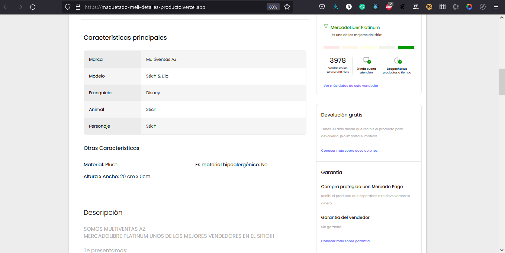

# Maquetado de la página de detalle!

¡Hola! En esta ocasión me reté a imitar la UI de mercado libre usando React, los estilos los hice todos a mano y solo usé react-icon para el tema de los SVG.
A continuación adjunto algunas capturas por si se cayó el deploy.

